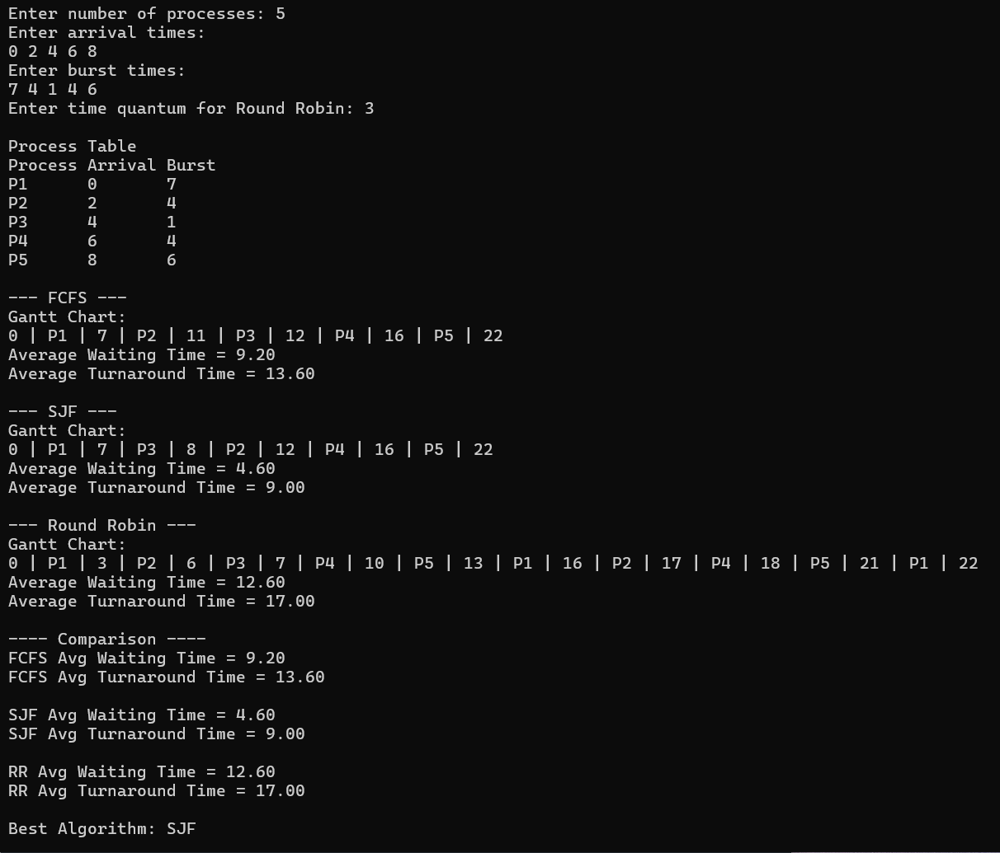

# CPU Scheduling Algorithm Simulator and Performance Comparator

## Objective
To compare different CPU scheduling algorithms and determine the most efficient algorithm based on waiting time.

## Algorithms Implemented
1. First Come First Serve (FCFS)
2. Shortest Job First (SJF)
3. Round Robin (RR)

## Input
User provides:
- number of processes
- arrival time
- burst time
- time quantum (for Round Robin)

## Output
Program displays:
- Gantt Chart
- Waiting Time
- Average Waiting Time
- Best Algorithm

## Sample Output

## Technologies Used
- C Programming Language
- Linux Concepts
- Makefile
- GitHub

## Project Structure
main.c → controls program flow  
fcfs.c → implements FCFS scheduling  
sjf.c → implements SJF scheduling  
round_robin.c → implements Round Robin scheduling  
scheduler.h → function declarations  
build.bat → Windows compilation automation
HOW_TO_RUN.txt → Execution instructions
README.md → Project documentation

## Features
- Accepts user input for processes
- Displays Gantt Chart
- Calculates Waiting Time
- Calculates Average Waiting Time
- Compares performance of algorithms
- Identifies best scheduling algorithm automatically
- Modular programming approach
- Automated compilation using batch file

## Skills Demonstrated
- C Programming
- Data Structures (Arrays)
- Algorithm Analysis
- Operating System Concepts
- Modular Programming
- GitHub Version Control
- Basic Automation (Batch Script)

## Conclusion
- SJF algorithm usually gives minimum waiting time.
- Round Robin ensures fair CPU allocation among processes.
- FCFS is simple but may lead to larger waiting times.

This project helps understand how operating systems manage CPU scheduling efficiently.
